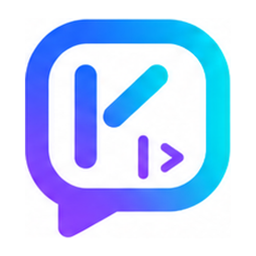
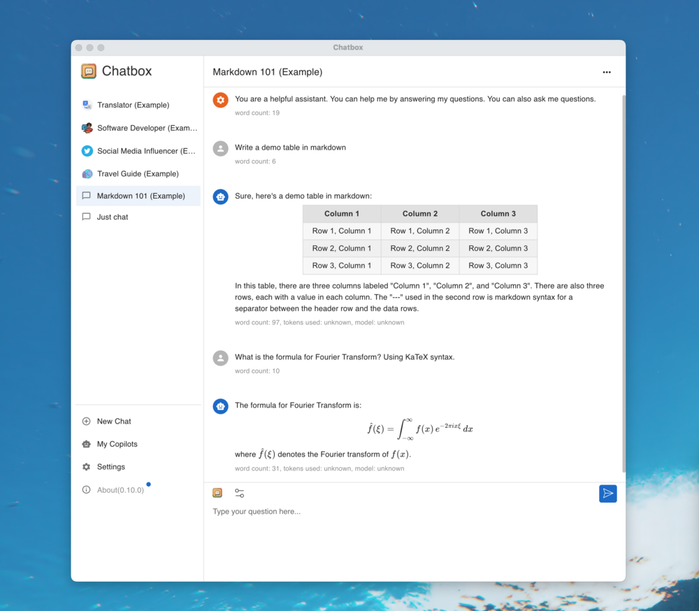
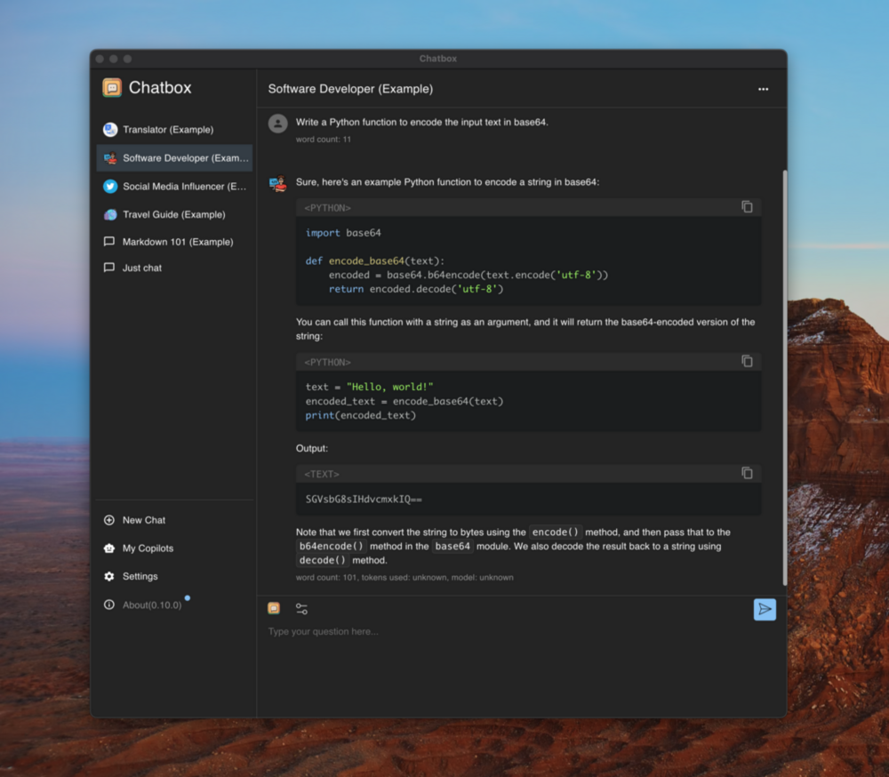

<p align="right">
  <a href="README.md">English</a> |
  <a href="./doc/README-CN.md">简体中文</a>
</p>

<h1 align="center">

<span>
    Kod
</span>
</h1>
<p align="center">
    <em>Your Ultimate AI Copilot on the Desktop. <br />Kod is a desktop client for ChatGPT, Claude and other LLMs, available on Windows, Mac, Linux</em>
</p>

<p align="center">


</p>

<p align="center">
  <a href="./doc/statics/snapshot_light.png">
    
  </a>
  <a href="./doc/statics/snapshot_dark.png">
    
  </a>
</p>

---

**Kod** is an open-source desktop AI client, released under the GPLv3 license.

Kod is based on [Chatbox Community Edition](https://github.com/chatboxai/chatbox) (GPLv3). We are grateful to the upstream project and continue to build on its foundation while keeping Kod fully open source.

## Build from Source

Kod does not ship prebuilt installers yet. To try it out, build it from source by following the [Development](#development) guide below and running `pnpm run package` for your platform.

## Features

### 🤖 AI Model Support
-   **Support for Multiple LLM Providers**  
    :gear: Seamlessly integrate with a variety of cutting-edge language models:
    -   OpenAI (ChatGPT)
    -   Azure OpenAI
    -   Claude
    -   Google Gemini Pro
    -   Ollama (enable access to local models like llama2, Mistral, Mixtral, codellama, vicuna, yi, and solar)
    -   ChatGLM-6B

-   **Image Generation with Dall-E-3**  
    :art: Create the images of your imagination with Dall-E-3.

-   **Enhanced Prompting**  
    :speech_balloon: Advanced prompting features to refine and focus your queries for better responses.

### 🖥️ User Experience
-   **Local Data Storage**  
    :floppy_disk: Your data remains on your device, ensuring it never gets lost and maintains your privacy.

-   **No-Deployment Installation Packages**  
    :package: Get started quickly with downloadable installation packages. No complex setup necessary!

-   **Ergonomic UI & Dark Theme**  
    :new_moon: A user-friendly interface with a night mode option for reduced eye strain during extended use.

-   **Keyboard Shortcuts**  
    :keyboard: Stay productive with shortcuts that speed up your workflow.

-   **Streaming Reply**  
    :arrow_forward: Provide rapid responses to your interactions with immediate, progressive replies.

### 📄 Content & Formatting
-   **Markdown, Latex & Code Highlighting**  
    :scroll: Generate messages with the full power of Markdown and Latex formatting, coupled with syntax highlighting for various programming languages, enhancing readability and presentation.

-   **Prompt Library & Message Quoting**  
    :books: Save and organize prompts for reuse, and quote messages for context in discussions.

### 👥 Collaboration & Sharing
-   **Team Collaboration**  
    :busts_in_silhouette: Collaborate with ease and share OpenAI API resources among your team. [Learn More](./team-sharing/README.md)

### 🌐 Platform Availability
-   **Cross-Platform Desktop**  
    :computer: Kod is ready for Windows, Mac, and Linux users.

-   **Web Version**  
    :globe_with_meridians: Use the web application on any device with a browser, anywhere.

### 🌍 Localization
-   **Multilingual Support**  
    :earth_americas: Catering to a global audience by offering support in multiple languages:
    -   English
    -   简体中文 (Simplified Chinese)
    -   繁體中文 (Traditional Chinese)
    -   日本語 (Japanese)
    -   한국어 (Korean)
    -   Français (French)
    -   Deutsch (German)
    -   Русский (Russian)
    -   Español (Spanish)

### ✨ More Features
-   **And More...**  
    :sparkles: Constantly enhancing the experience with new features!

## FAQ

-   [Frequently Asked Questions](./doc/FAQ.md)

## How to Contribute

We welcome contributions from the community! Here's how you can help make Kod better:

### 🐛 Reporting Issues
- Use the [issue tracker](https://gitlab.kaiweb.org/kod-projects/kod/-/issues) to report bugs or request features
- Before creating a new issue, please search existing issues to avoid duplicates
- Provide detailed information including steps to reproduce, expected behavior, and screenshots if applicable

### 🔧 Merge Requests
1. Fork the repository and create your branch from `main`
2. Make your changes and ensure the code follows our coding standards
3. Test your changes thoroughly
4. Update documentation if needed
5. Submit a merge request with a clear description of the changes

### 🌍 Translations
Help make Kod accessible to more people by contributing translations:
- Translation files are located in the `src/locales` directory
- Follow the existing translation format
- Submit a merge request with your translation improvements

### 📖 Documentation
- Improve README, API documentation, or user guides
- Fix typos or clarify unclear instructions
- Add examples and tutorials

**Thank you for contributing! 🙏**

## Development

### Prerequisites

Before you begin, ensure you have the following installed:

- **Node.js** (v22.x or later) - [Download here](https://nodejs.org/)
- **pnpm** (v10.x or later) - Install via `corepack enable && corepack prepare pnpm@latest --activate`
- **Git** - [Download here](https://git-scm.com/)

### Quick Setup

1. **Clone the repository**
   ```bash
   git clone https://gitlab.kaiweb.org/kod-projects/kod.git
   cd kod
   ```

2. **Install dependencies**
   ```bash
   pnpm install
   ```

3. **Start development server**
   ```bash
   pnpm run dev
   ```
   The application will start in development mode with hot-reload enabled.

### Build Commands

| Command | Description |
|---------|-------------|
| `pnpm run dev` | Start development server with hot-reload |
| `pnpm run package` | Build and package for current platform |
| `pnpm run package:all` | Build and package for all platforms |
| `pnpm run build` | Build for production without packaging |
| `pnpm run lint` | Run Biome to check code quality |
| `pnpm run test` | Run Vitest test suite |

### Project Structure

```
kod/
├── src/
│   ├── main/               # Electron main process
│   ├── renderer/           # React renderer (UI)
│   ├── preload/            # Electron preload scripts
│   └── shared/             # Shared utilities
├── doc/                    # Documentation and assets
├── resources/              # App resources and icons
├── team-sharing/           # Team collaboration features
└── package.json            # Project configuration
```

### Development Tips

- Use `pnpm run lint` before committing to ensure code quality
- Follow the existing code style and patterns
- Test your changes on both light and dark themes
- Ensure cross-platform compatibility when making UI changes

### Troubleshooting

**Issue**: `pnpm install` fails
- **Solution**: Ensure you're using pnpm (not npm or yarn) and Node.js version is within the required range. Run `corepack enable` if pnpm is not found.

**Issue**: Build fails on Windows
- **Solution**: Run `pnpm config set script-shell "C:\\Program Files\\git\\bin\\bash.exe"` if using Git Bash

**Issue**: Changes not reflecting in development
- **Solution**: Stop the dev server, delete `node_modules/.vite`, and restart

## License

Kod is open-sourced under the [GPLv3](./LICENSE) license, in accordance with its upstream project Chatbox Community Edition.
